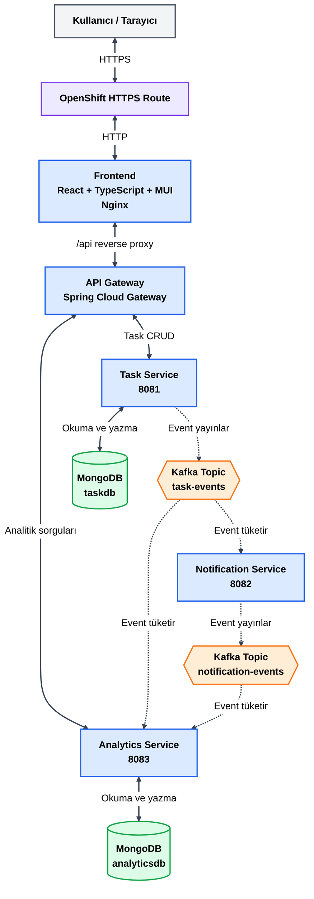
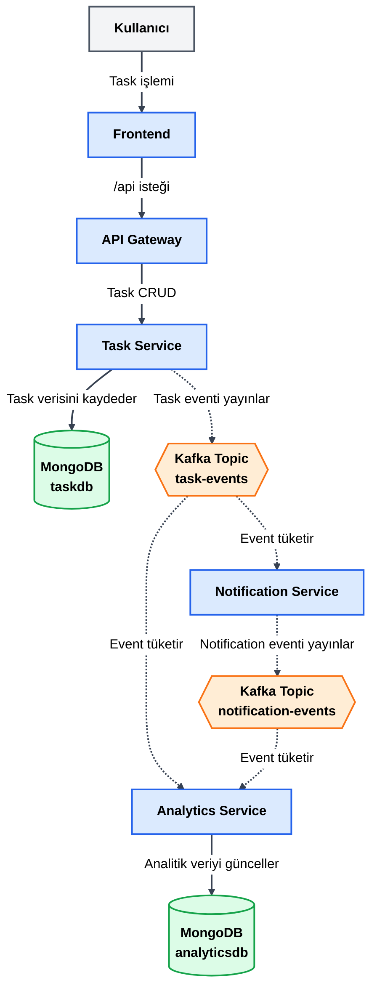
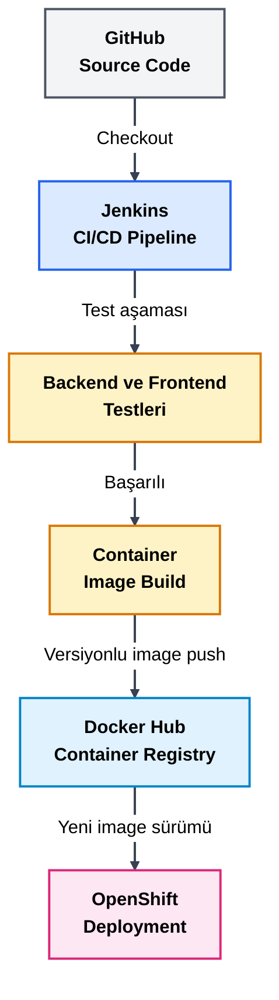

# Task Management System

Kafka tabanlı asenkron olay akışları kullanan, bağımsız geliştirilebilen ve deploy edilebilen beş uygulamadan oluşan mikroservis tabanlı görev yönetim sistemi.

Proje; görev yönetimi, bildirim üretimi, analitik veri oluşturma, merkezi API yönlendirme ve web arayüzü bileşenlerini uçtan uca çalışan bir mimari içerisinde birleştirir.

## Proje Durumu

Aşağıdaki süreçler başarıyla tamamlanmıştır:

- Mikroservislerin geliştirilmesi
- MongoDB entegrasyonu
- Kafka event akışları
- API Gateway yönlendirmeleri
- React kullanıcı arayüzü
- Podman ile container image oluşturma
- Podman Compose ile yerel ortam kurulumu
- Docker Hub container registry entegrasyonu
- Jenkins CI pipeline
- Jenkins ve OpenShift CD entegrasyonu
- OpenShift üzerinde HTTPS erişimli deployment
- Kalıcı MongoDB ve Kafka depolaması
- Uçtan uca fonksiyonel testler

## Özellikler

- Yeni task oluşturma
- Kullanıcıya ait task’ları listeleme
- Task durumunu güncelleme
- Task silme
- Task durumlarına göre analitik veriler
- Kafka tabanlı bildirim üretimi
- Toplam notification sayısının hesaplanması
- API Gateway üzerinden merkezi backend erişimi
- Responsive React kullanıcı arayüzü
- Container tabanlı local ve OpenShift deployment
- Jenkins üzerinden otomatik test, build, image push ve deployment

## Mikroservis Mimarisi



### Diyagram Renkleri

- **Açık mavi:** Uygulama servisleri
- **Yeşil:** MongoDB veritabanları
- **Turuncu:** Kafka topic’leri
- **Mor:** OpenShift Route ve altyapı bileşenleri
- **Gri:** Kullanıcı ve harici kaynaklar
- **Sarı:** CI/CD test ve image build aşamaları

## Temel Mimari Kurallar

- Tarayıcıdan backend mikroservislerine doğrudan istek gönderilmez.
- Bütün REST trafiği API Gateway üzerinden yönlendirilir.
- Task Service yalnızca `taskdb` veritabanını kullanır.
- Analytics Service yalnızca `analyticsdb` veritabanını kullanır.
- Notification Service veritabanı kullanmaz.
- Notification Service business REST API sunmaz.
- `task-events`, Task Service tarafından yayınlanır.
- `task-events`, Notification Service ve Analytics Service tarafından tüketilir.
- `notification-events`, Notification Service tarafından yayınlanır.
- `notification-events`, Analytics Service tarafından tüketilir.
- MongoDB ve Kafka uygulama servisi değil, altyapı bileşenidir.
- OpenShift dış Route yalnızca Frontend için açılır.
- Backend servisleri OpenShift internal DNS üzerinden haberleşir.

## Event Akışı

Yeni bir task oluşturulduğunda veya mevcut bir task üzerinde işlem yapıldığında aşağıdaki akış gerçekleşir:



## Repository Yapısı

```text
task-management-system/
├── task-service/              # Git submodule
├── notification-service/      # Git submodule
├── analytics-service/         # Git submodule
├── api-gateway/               # Git submodule
├── frontend/                  # Git submodule
├── jenkins/
│   └── Containerfile
├── openshift/
│   ├── mongodb.yaml
│   ├── kafka.yaml
│   ├── backend-services.yaml
│   ├── frontend.yaml
│   └── README.md
├── docs/
│   └── CI-CD.md
├── compose.yaml
├── Jenkinsfile
└── README.md
```

Her uygulama ayrı bir Git repository, build ve deployment birimidir. Üst repository uygulamaları Git submodule olarak takip eder ve ortak altyapı, CI/CD ve deployment dosyalarını barındırır.

## Teknoloji Yığını

### Backend

- Java 21
- Spring Boot
- Spring Web
- Spring Validation
- Spring Data MongoDB
- Spring Kafka
- Spring Cloud Gateway
- Spring Boot Actuator
- Maven

### Frontend

- React
- TypeScript
- Vite
- Material UI
- Axios
- React Router
- Nginx

### Veri ve Mesajlaşma

- MongoDB 8
- Apache Kafka 4.1.1
- Kafka KRaft modu

### DevOps

- Git ve GitHub
- Git Submodule
- Podman
- Podman Compose
- Docker Hub
- Jenkins
- OpenShift
- OpenShift CLI
- Kubernetes/OpenShift YAML manifestleri

## Servisler

| Bileşen | Sorumluluk | Yerel port |
|---|---|---:|
| Task Service | Task CRUD ve task event üretimi | 8081 |
| Notification Service | Task event tüketimi ve notification event üretimi | 8082 |
| Analytics Service | Task ve notification analitikleri | 8083 |
| API Gateway | Merkezi API yönlendirmesi | 8084 |
| Frontend | Kullanıcı ve analytics arayüzü | 5173 |
| MongoDB | Task ve analytics verilerinin saklanması | 27017 |
| Kafka | Mikroservisler arası asenkron event iletişimi | 19092 |

> Yerel portlar geliştirme ortamı içindir. OpenShift ortamında servisler internal DNS ve ClusterIP Service kaynakları üzerinden iletişim kurar.

## Veritabanları

Tek MongoDB kurulumu üzerinde mantıksal olarak ayrılmış iki veritabanı bulunur:

| Veritabanı | Kullanan servis | Amaç |
|---|---|---|
| `taskdb` | Task Service | Task kayıtlarının saklanması |
| `analyticsdb` | Analytics Service | Analitik projection verilerinin saklanması |

Servisler birbirlerinin veritabanına doğrudan erişmez.

## Kafka Topic’leri

| Topic | Producer | Consumer |
|---|---|---|
| `task-events` | Task Service | Notification Service, Analytics Service |
| `notification-events` | Notification Service | Analytics Service |

Topic’ler local ve OpenShift ortamlarında `kafka-init` işlemi tarafından otomatik oluşturulur.

## API Erişimi

Frontend bütün backend isteklerini API Gateway üzerinden gerçekleştirir.

Temel endpoint’ler:

```text
/api/tasks/**
/api/analytics/**
/api/analytics/summary
/actuator/health
```

API Gateway yönlendirmeleri:

```text
/api/tasks/**      → Task Service
/api/analytics/**  → Analytics Service
```

## Yerel Ortamı Çalıştırma

### Gereksinimler

- Git
- Podman
- Podman Machine
- Podman Compose desteği

Repository’yi submodule’larla birlikte alın:

```powershell
git clone --recurse-submodules `
  https://github.com/YusuffBulbul/task-management-system.git
```

Repository daha önce clone edildiyse submodule’ları güncelleyin:

```powershell
git submodule update --init --recursive
```

Podman Machine’i başlatın:

```powershell
podman machine start
```

Bütün sistemi çalıştırın:

```powershell
podman compose -f .\compose.yaml up -d
```

Container durumlarını kontrol edin:

```powershell
podman compose -f .\compose.yaml ps -a
```

Frontend’i açın:

```text
http://localhost:5173
```

API Gateway adresi:

```text
http://localhost:8084
```

Sistemi durdurmak için:

```powershell
podman compose -f .\compose.yaml down
```

> Kalıcı MongoDB ve Kafka verilerini korumak için `down -v` komutu kullanılmamalıdır.

## Container Image’ları

Pipeline tarafından oluşturulan image’lar Docker Hub üzerinde tutulur:

- [Task Service](https://hub.docker.com/r/yusuffbulbul/task-service)
- [Notification Service](https://hub.docker.com/r/yusuffbulbul/notification-service)
- [Analytics Service](https://hub.docker.com/r/yusuffbulbul/analytics-service)
- [API Gateway](https://hub.docker.com/r/yusuffbulbul/api-gateway)
- [Frontend](https://hub.docker.com/r/yusuffbulbul/task-management-frontend)

Image sürümleri Jenkins build numarasıyla oluşturulur:

```text
1.0.${BUILD_NUMBER}
```

Örneğin Jenkins build numarası `5` ise:

```text
1.0.5
```

## CI/CD Süreci

Jenkins pipeline aşağıdaki işlemleri gerçekleştirir:

1. Ana repository ve submodule’ları GitHub’dan alır.
2. Backend servislerinin Maven testlerini çalıştırır.
3. Frontend lint ve build işlemlerini çalıştırır.
4. Beş uygulama için container image oluşturur.
5. Image’ları versiyonlayarak Docker Hub’a gönderir.
6. ServiceAccount token’ı kullanarak OpenShift’e bağlanır.
7. Uygulama Deployment’larını yeni image sürümüne geçirir.
8. Bütün rollout işlemlerinin başarıyla tamamlanmasını doğrular.



Jenkins yerel ortamda çalıştığı için pipeline kontrollü olarak Jenkins arayüzündeki `Şimdi Yapılandır` seçeneğiyle başlatılır.

Detaylı CI/CD dokümantasyonu:

- [CI/CD Dokümantasyonu](docs/CI-CD.md)

## OpenShift Deployment

Uygulama OpenShift Developer Sandbox üzerinde çalışmaktadır.

OpenShift bileşenleri:

- MongoDB Deployment, Service ve PersistentVolumeClaim
- Kafka Deployment, Service, ConfigMap ve PersistentVolumeClaim
- Kafka topic initialization Job
- Dört backend Deployment
- Backend ClusterIP Service kaynakları
- Frontend Deployment ve Service
- HTTPS OpenShift Route

Manifestler aşağıdaki sırayla uygulanır:

1. `openshift/mongodb.yaml`
2. `openshift/kafka.yaml`
3. `openshift/backend-services.yaml`
4. `openshift/frontend.yaml`

Detaylı deployment dokümantasyonu:

- [OpenShift Deployment Dokümantasyonu](openshift/README.md)

## Kalıcı Depolama

OpenShift ortamında aşağıdaki PersistentVolumeClaim kaynakları kullanılır:

- `mongodb-data`
- `kafka-data`

Uygulama servislerinin yeni sürüme geçirilmesi MongoDB ve Kafka verilerini silmez. PersistentVolumeClaim kaynaklarının silinmesi veri kaybına neden olabilir.

## Health Check

Spring Boot servisleri Actuator endpoint’i üzerinden kontrol edilir:

```text
/actuator/health
```

OpenShift Deployment kaynaklarında readiness ve liveness probe’ları tanımlanmıştır. Sağlıklı olmayan bir sürüm rollout işlemini tamamlayamaz ve Jenkins pipeline başarısız olur.

## Test Edilen Senaryolar

Aşağıdaki senaryolar local ve OpenShift ortamlarında doğrulanmıştır:

- Task oluşturma
- Task listeleme
- Task durumunu güncelleme
- Task silme
- Task verilerinin MongoDB’de saklanması
- Sayfa yenilendiğinde task verilerinin korunması
- Task event’lerinin Kafka’ya gönderilmesi
- Notification event’lerinin oluşturulması
- Analytics verilerinin güncellenmesi
- API Gateway yönlendirmeleri
- Frontend üzerinden uçtan uca CRUD işlemleri
- Jenkins tarafından image oluşturulması
- Docker Hub’a image gönderimi
- Jenkins üzerinden OpenShift deployment
- OpenShift rollout doğrulaması

## Güvenlik

- GitHub, Docker Hub ve OpenShift token’ları repository içerisinde tutulmaz.
- Hassas bilgiler Jenkins Credentials içerisinde saklanır.
- OpenShift deployment işlemleri ayrı bir `jenkins-deployer` ServiceAccount ile gerçekleştirilir.
- ServiceAccount yalnızca ilgili OpenShift projesinde yetkilidir.
- Container’larda privilege escalation kapatılmıştır.
- OpenShift dış erişimi yalnızca HTTPS Frontend Route üzerinden sağlanır.

## Ortam Notu

OpenShift Developer Sandbox geliştirme, öğrenme ve demonstrasyon amacıyla kullanılmaktadır. Sandbox kaynak ve kullanım süresi sınırlarına sahip olduğu için production ortamı olarak değerlendirilmemelidir.