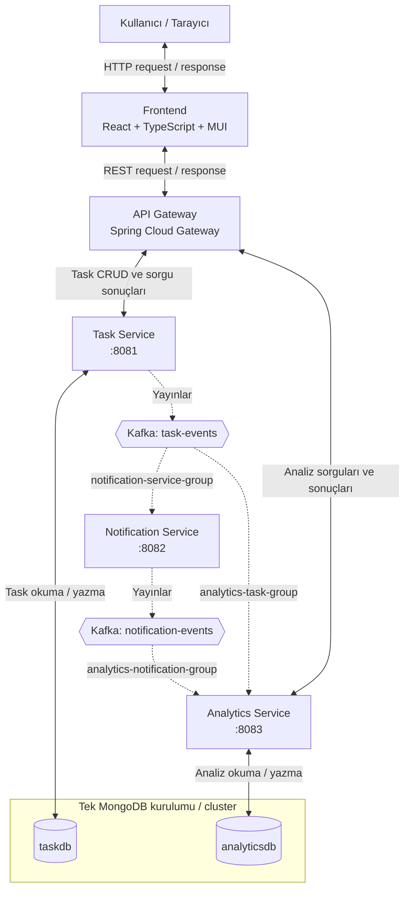

# Task Management System

Kafka tabanlı olay akışları kullanan, bağımsız dağıtılabilir beş uygulamadan oluşan mikroservis tabanlı görev yönetim sistemi.

## Mikroservis mimarisi



### Temel kurallar

- Tarayıcıdan backend servislerine doğrudan istek gönderilmez; bütün REST trafiği API Gateway üzerinden geçer.
- Task Service yalnızca `taskdb` veritabanından okur ve bu veritabanına yazar.
- Analytics Service yalnızca `analyticsdb` veritabanından okur ve bu veritabanına yazar.
- Notification Service veritabanı kullanmaz ve business REST API sunmaz.
- `task-events`, Task Service tarafından yayınlanır; Notification ve Analytics servisleri tarafından tüketilir.
- `notification-events`, Notification Service tarafından yayınlanır; Analytics Service tarafından tüketilir.
- Kafka ve MongoDB altyapı bileşenidir; deploy edilen uygulama sayısına dahil değildir.
- OpenShift dış Route yalnızca Frontend için açılır.

## Repository yapısı

```text
task-management-system/
├── frontend/              # Git submodule
├── api-gateway/           # Git submodule
├── task-service/          # Git submodule
├── notification-service/  # Git submodule
├── analytics-service/     # Git submodule
├── compose.yaml
└── helm/
```

Her uygulama bağımsız Git repository, build ve deployment birimidir. Üst repository uygulamaları gerçek Git submodule olarak takip eder ve ortak Docker Compose ile Helm dosyalarını barındırır.

## Teknolojiler

- Java 21, Spring Boot, Maven
- React, TypeScript, Vite, Material UI
- Apache Kafka
- MongoDB
- Docker Compose
- Jenkins
- Helm
- Red Hat OpenShift

## Yerel portlar

| Uygulama | Port |
|---|---:|
| Task Service | 8081 |
| Notification Service | 8082 |
| Analytics Service | 8083 |
| API Gateway | 8084 |
| Frontend | 5173 |

> Yerel portlar geliştirme içindir. Container ve OpenShift ortamlarında servis portları ortam yapılandırmasıyla yönetilir.
