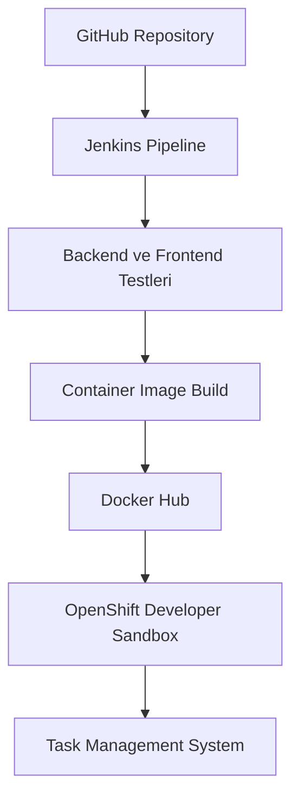

# CI/CD Süreci

Bu doküman, Task Management System projesinde kullanılan Jenkins, Docker Hub ve OpenShift tabanlı CI/CD sürecini açıklar.

## Genel Akış



## Kullanılan Teknolojiler

- GitHub
- Jenkins
- Maven
- npm
- Docker CLI
- Podman Engine
- Docker Hub
- OpenShift
- OpenShift CLI
- Kubernetes Deployment ve Service kaynakları

## Jenkins Ortamı

Jenkins, özel olarak hazırlanan bir container image içerisinde çalışmaktadır.

Jenkins image’ı aşağıdaki araçları içerir:

- Java 21
- Maven
- Node.js 22
- npm
- Git
- Docker CLI
- OpenShift CLI
- Jenkins Pipeline eklentileri

Jenkins container’ı, Podman socket üzerinden container image oluşturabilmektedir.

## Jenkins Credentials

Pipeline aşağıdaki Jenkins credential kayıtlarını kullanır:

| Credential ID | Amaç |
|---|---|
| `github-pat` | Private GitHub repository ve submodule erişimi |
| `dockerhub-credentials` | Docker Hub’a image gönderimi |
| `openshift-token` | OpenShift ServiceAccount kimlik doğrulaması |
| `openshift-server` | OpenShift API sunucu adresi |

Credential değerleri `Jenkinsfile`, GitHub veya YAML dosyalarında tutulmaz.

## Image Versiyonlama

Container image’ları Jenkins build numarası kullanılarak versiyonlanır:

```text
1.0.${BUILD_NUMBER}
```

Örnek:

```text
1.0.5
```

Her Jenkins build’i kendisine ait benzersiz bir image sürümü üretir.

## Pipeline Aşamaları

### 1. Checkout

Ana repository ve private Git submodule’ları GitHub üzerinden alınır.

### 2. Backend Testleri

Aşağıdaki servislerin Maven testleri çalıştırılır:

- Task Service
- Notification Service
- Analytics Service
- API Gateway

Kafka listener’ları test sırasında otomatik başlatılmaz.

### 3. Frontend Test ve Build

Frontend için aşağıdaki işlemler uygulanır:

```text
npm ci
npm run lint
npm run build
```

### 4. Container Image Build

Her uygulama bileşeni için ayrı container image oluşturulur:

- Task Service
- Notification Service
- Analytics Service
- API Gateway
- Frontend

### 5. Docker Hub Push

Başarıyla oluşturulan image’lar Docker Hub’a gönderilir:

```text
docker.io/yusuffbulbul/task-service
docker.io/yusuffbulbul/notification-service
docker.io/yusuffbulbul/analytics-service
docker.io/yusuffbulbul/api-gateway
docker.io/yusuffbulbul/task-management-frontend
```

### 6. OpenShift Deployment

Jenkins, `jenkins-deployer` ServiceAccount token’ı ile OpenShift’e bağlanır.

Aşağıdaki Deployment kaynaklarının image sürümleri güncellenir:

- `task-service`
- `notification-service`
- `analytics-service`
- `api-gateway`
- `frontend`

MongoDB ve Kafka bu aşamada yeniden deploy edilmez.

### 7. Rollout Kontrolü

Jenkins, her Deployment’ın başarılı şekilde ayağa kalkmasını bekler.

Herhangi bir Deployment belirlenen süre içerisinde hazır duruma gelemezse pipeline başarısız kabul edilir.

## Deployment Ortamı

Uygulama aşağıdaki OpenShift projesinde çalışmaktadır:

```text
yusuffbulbul-dev
```

Frontend, OpenShift HTTPS Route üzerinden dış erişime açılmıştır.

## Kalıcı Veriler

Aşağıdaki veriler PersistentVolumeClaim üzerinde saklanır:

- MongoDB verileri
- Kafka verileri

Uygulama servislerinin yeni image sürümüne geçirilmesi bu verileri silmez.

## Pipeline Çalıştırma

Jenkins yerel ortamda çalıştığı için pipeline manuel olarak başlatılır:

1. Jenkins arayüzü açılır.
2. `task-management-ci` job’ına girilir.
3. `Şimdi Yapılandır` seçeneğine basılır.
4. Pipeline aşamaları Jenkins üzerinden takip edilir.

## Başarı Kriterleri

Pipeline aşağıdaki koşulların tamamı sağlandığında başarılı kabul edilir:

- Backend testleri başarılıdır.
- Frontend lint ve build işlemleri başarılıdır.
- Bütün container image’ları oluşturulmuştur.
- Image’lar Docker Hub’a gönderilmiştir.
- OpenShift kimlik doğrulaması başarılıdır.
- Beş uygulama Deployment’ı güncellenmiştir.
- Bütün rollout işlemleri başarıyla tamamlanmıştır.
- Uygulama HTTPS Route üzerinden erişilebilir durumdadır.

## Güvenlik

- Erişim token’ları GitHub’a yüklenmez.
- Token’lar Jenkins Credentials içerisinde saklanır.
- OpenShift deployment işlemi, proje seviyesinde yetkilendirilmiş özel bir ServiceAccount ile gerçekleştirilir.
- Container’lar yetki yükseltmeye izin vermeyen güvenlik ayarlarıyla çalıştırılır.